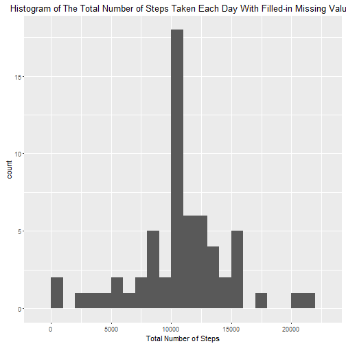

# Reproducible Research: Peer Assessment 1

## Loading and preprocessing the data


```r
setwd("C:/Users/Owner/Documents/Coursera_Reproducible_Research/project1")

unzip(zipfile="repdata_data_activity.zip")
activity <- read.csv("activity.csv", sep = ",", header = TRUE, na.strings ="NA", stringsAsFactors = FALSE)
```

## What is mean total number of steps taken per day?


```r
library(ggplot2)

#Calculate the total number of steps taken per day
total_steps <- aggregate(steps ~ date, data = activity, sum, na.rm=TRUE)

#Make a histogram of the total number of steps taken each day
plot1 <- ggplot(total_steps, aes(steps))
plot1 <- plot1 + geom_histogram(binwidth=1000) + 
        labs(x="Total Number of Steps") +
        labs(title="Histogram of The Total Number of Steps Taken Each Day")
print(plot1)
```

 

```r
#Calculate and report the mean and median of the total number of steps taken per day
mean(total_steps$steps)
```

```
## [1] 10766.19
```

```r
median(total_steps$steps)
```

```
## [1] 10765
```

## What is the average daily activity pattern?


```r
#The average number of steps taken
averages <- aggregate(steps ~ interval, data = activity, mean, na.rm=TRUE)

#Create time series plot
library(ggplot2)

plot2 <- ggplot(averages, aes(interval, steps)) + 
        geom_line(color = "blue", size = 0.7) + 
        labs(title = "Time Series Plot of the 5-minute Intervals", x = "5-minute intervals", y = "Average Number of Steps Taken")

print(plot2)
```

 

Which 5-minute interval, on average across all the days in the dataset, contains the maximum number of steps?


```r
averages[which.max(averages$steps),]
```

```
##     interval    steps
## 104      835 206.1698
```

## Imputing missing values

Calculate and report the total number of missing values in the dataset (i.e. the total number of rows with NAs)


```r
sum(is.na(activity$steps))
```

```
## [1] 2304
```

Replace missing values with mean for that 5-minute interval. 


```r
full_activity <- activity
for (i in 1:nrow(full_activity)) {
        if (is.na(full_activity$steps[i])) {
                full_activity$steps[i] <- averages[which(full_activity$interval[i] == averages$interval), ]$steps
        }
}
```

Make a histogram of the total number of steps taken each day with filled-in missing values and calculate the mean and median total number of steps.


```r
#Total of steps per day with filled-in missing values
total_full <- aggregate(steps ~ date, data = full_activity, sum)

#Make a histogram of the total number of steps taken each day with filled-in missing values
library(ggplot2)

plot3 <- ggplot(total_full, aes(steps))
plot3 <- plot3 + geom_histogram(binwidth=1000) + 
        labs(x="Total Number of Steps") +
        labs(title="Histogram of The Total Number of Steps Taken Each Day With Filled-in Missing Values")
print(plot3)
```

 

```r
#Calculate and report the mean and median of the total number of steps taken per day
#with filled-in missing values
mean(total_full$steps)
```

```
## [1] 10766.19
```

```r
median(total_full$steps)
```

```
## [1] 10766.19
```

Median value is higher after the missing values were replaced.  Mean stays the same.  In the original data set, there are days that steps values were missing for any interval.  Therefore, the number of steps taken for those days are set to 0.  After the missing steps values were replaced, the 0 values were removed.

## Are there differences in activity patterns between weekdays and weekends?


```r
library(lattice)

#Find weekday and weekend date
day_of_week <- function(date) {
        day <- weekdays(as.Date(date))
        if (day %in% c("Monday", "Tuesday", "Wednesday", "Thursday", "Friday"))
                return("weekday")
        else if (day %in% c("Saturday", "Sunday"))
                return("weekend")
}

full_activity$day <- sapply(full_activity$date, FUN=day_of_week)

#The average number of steps taken by interval and day
averages_full <- aggregate(steps ~ interval + day, data = full_activity, mean)

#create plot
plot4 <- xyplot(averages_full$steps ~ averages_full$interval | averages_full$day, 
                layout = c(1, 2), type = "l", 
                xlab = "Interval", ylab = "Number of steps")
print(plot4)
```

 
